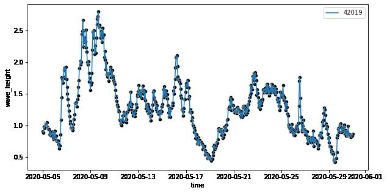
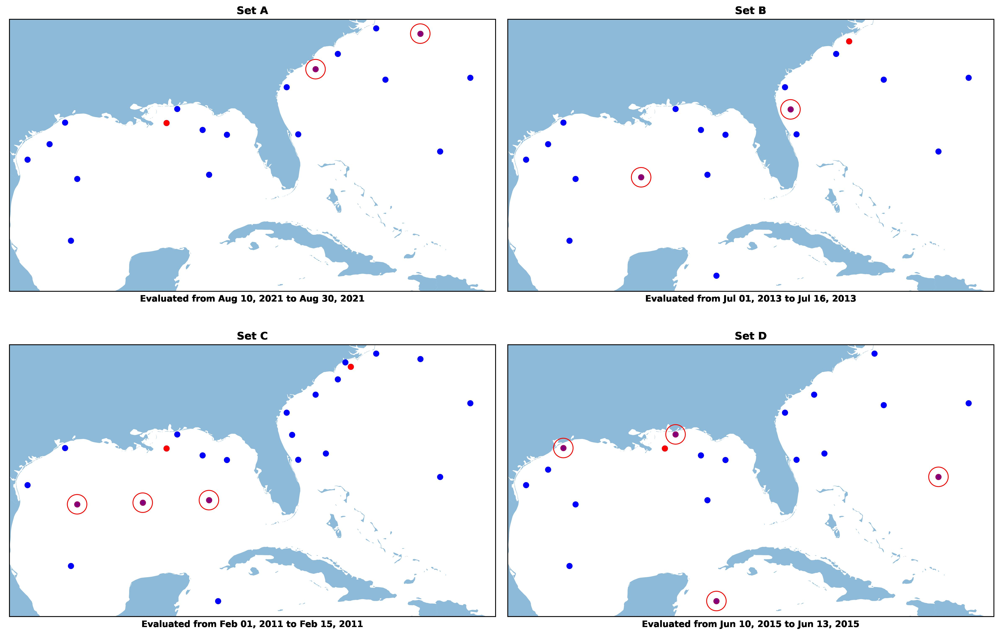
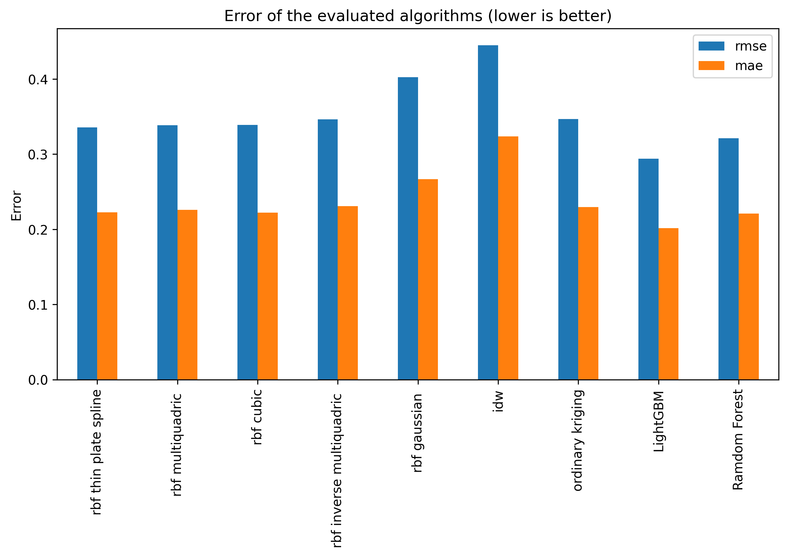

# Spatial Interpolation on NDBC Data

An empirical study and comparison of Deterministic, Statistical, and ML Algorithms for the Spatial Interpolation of significant wave height values collected by buoy and sea monitoring stations  managed by the United States' [National Data Buoy Center](https://www.ndbc.noaa.gov/) (NDBC) located near costs of the Southern Atlantic regions of the United States, including those on the Gulf of Mexico and parts of the Caribbean.

|  |
| :--: |
| Spatial Interpolation of wave height in the area at a certain timestamp. Black dots indicate the points that have been actually sampled. Red circles were excluded from training data  | 

## Techniques Studied:

- **Deterministic methods:** such as [linear barycentric interpolation](https://dahtah.wordpress.com/2013/03/06/barycentric-interpolation-fast-interpolation-on-arbitrary-grids/#:~:text=Barycentric%20interpolation%20generalises%20linear%20interpolation,now%20it%20as%20algorithm%2021.7.), [Inverse Distance Weighting](https://en.wikipedia.org/wiki/Inverse_distance_weighting) (IDW), and [Radial Basis Function](https://en.wikipedia.org/wiki/Radial_basis_function_interpolation) (RBF) Interpolation.
- **Statistical methods:** [Kriging](https://en.wikipedia.org/wiki/Kriging) Interpolation
 (Gaussian Process Regression).
- **Machine Learning methods:** [LightGBM](https://lightgbm.readthedocs.io/en/latest/) and [Random Forests](https://scikit-learn.org/stable/modules/generated/sklearn.ensemble.RandomForestRegressor.html).

## Technical Approach:

- The experimental study was conducted on a **large** dataset consisting of hourly wave and meteorological measurements on the 2010-2022 period collected by buoys moored in the Mid Atlantic near the south-East coast of the continental United States.
- Data was downloaded directly from the [historical standard meteorological archive of the NDBC](https://www.ndbc.noaa.gov/data/historical/). The locations of each of the [targeted buoys](/references/ndbc-south_atlantic_stations.json) was obtained by scraping the webpages that lists their individual information (e.g: https://www.ndbc.noaa.gov/station_page.php?station=44008).

|  | 
| :----: |
|Timeseries of wave height measurements from buoy #42019 |

- The general preprocessing steps were done by defining [a kedro pipeline](/src/spatial_interpolation/pipelines/noaa/data_processing.py) to detect and parse missing values, format the columns, and convert it to a geo-parquet format ([Geopandas](https://geopandas.org/) was used for read/write operations and to work with it as geospatial data).
- The data was then split into training and test sets. The test set itself consisted of several subsets of selected data, each of which was used to evaluate the performance of the algorithms based on the specific spatial configuration of the buoys available in each set.

<!--  -->

|  |
| :----: |
|Test subsets evaluated in this area. Inside red circles are the buoys that were not available in the training set of each period mentioned.|

- Evaluation was conducted by writing individual [MLFlow experiments](https://mlflow.org/docs/latest/experiment.html) of each of the algorithms and were then executed with each of the subsets of the test data on parallel (see the [experiments/](/experiments/) directory to see examples of this).
- The results of the experiments were then analyzed by comparing the performance of the algorithms on the test sets.

## Results:

The results of the study favour the use of ML algorithms over the use of other methods when paired with a strong feature set that are able to capture the spatial distribution of the data well. While they achieve similar error than other algorithms in sets that test interpolation inside the convex hull of the data (such as those in sets A,B,C) they are much better than the others on points that would require extrapolation outside the convex hull of the data (sets D,E,F). 

Of the two ML methods, Gradient Boost ([LightGBM](https://lightgbm.readthedocs.io/en/latest/)) was the one that turned out to be most successful not only on accuracy but also when comparing the time it takes to run inference in comparison to Random Forest (LightGBM is over 3x faster).